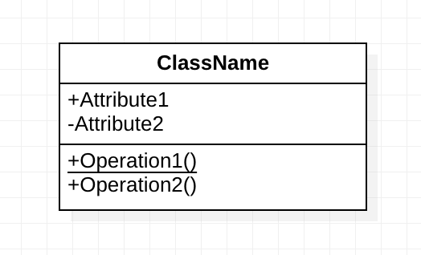
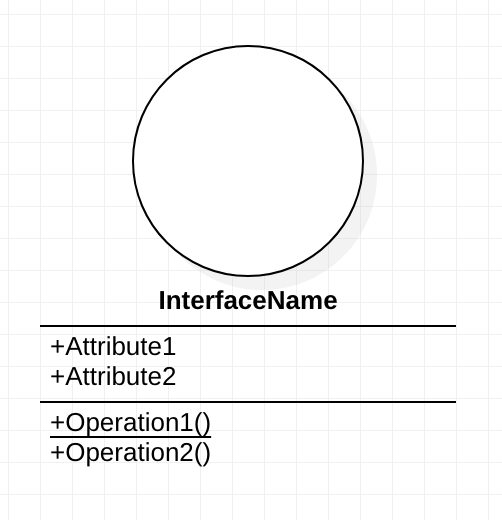
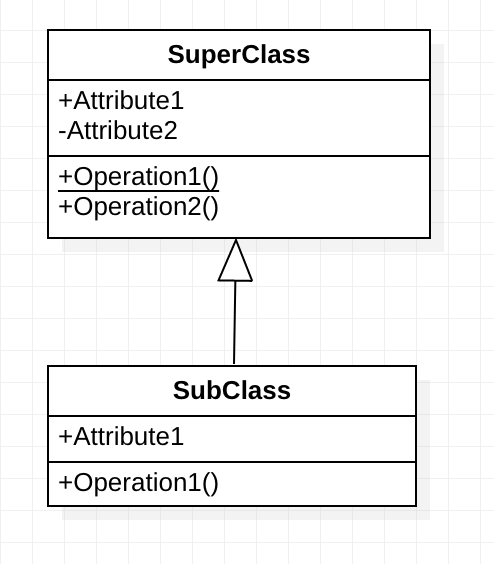
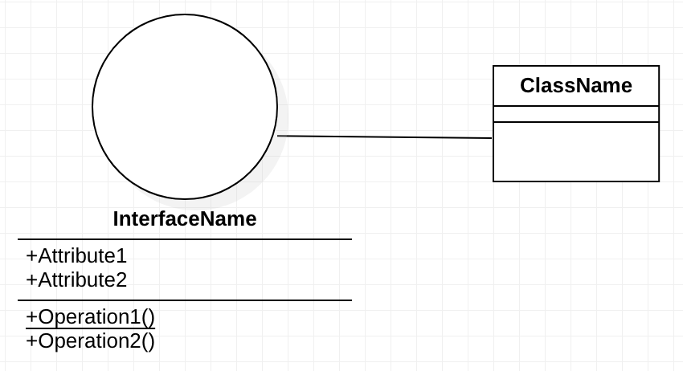
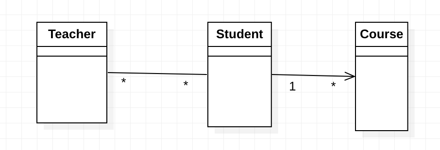
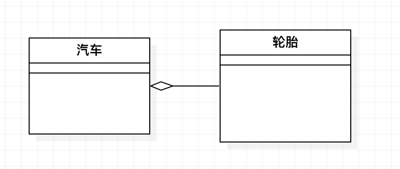
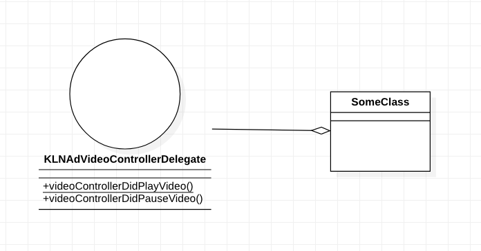
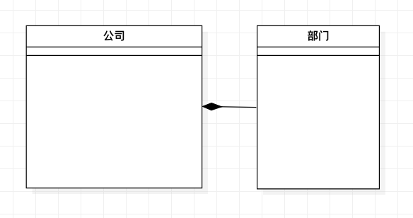
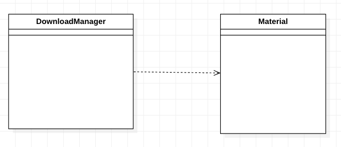

# UML基本使用--类图

### 背景

> 一方面随着项目组件化的进行，越来越多的模块需要输出更为详细与易理解文档，而在描述文档的时候或多或少会加入类与类之间关系的描述。
>
> 另一方面是如果在需求预演的时候，在涉及到较大的模块的情况，如果能首先输出类图的话，会更好的体现出模块的代码结构是否合理，所以为了更好的统一大家在使用UML的描述方式，本文在此对使用UML绘制 iOS 下的类图做简要介绍

### 推荐工具 [StarUML](http://staruml.io/download)

### 基本概念

类图是面向对象编程中最常用和最重要的图。类图主要是用来描述项目中的类，接口，以及它们之间的结构和关系。

类图的3个基本组件：`类名`，`属性`，`方法`。

在描述方法时可以通过在方法下面添加一个横线来区分类方法和实例方法，前缀的	`+-#~`分别表示不同的可见性。其中：

- `+` Public
- `-` Private
- `#` Protected
- `~` Package

接口（协议）：

在UML类图中，常见的有以下几种关系：继承(Generalization)，实现(Realization)，关联(Association)，聚合(Aggregation)，组合(Composition)，依赖(Dependency)

##### 继承(Generalization) 

【定义】：表示的是子类和父类的关系，例如猫和动物的关系一样

【描述方式】：带三角箭头的实现，箭头指向父类

##### 实现(Realization)

【定义】：描述的是一种类与接口(协议)的关系

【描述方式】：用带三角箭头的虚线表示，箭头指向接口。

##### 关联(Association)

【定义】：是一种拥有关系，它使得一个类知道另一个类的属性或方法，且分为双向关联和单向关联。

例如老师和学生是双向关联，老师可以有多名学生，学生也可以有多名老师；但学生和课程之间就是单向关联的，一个学生可以有多门课程上，但是课程不拥有学生。

【描述方式】：双向关联的关系用一条直线连接两个类，并在两头标注数量对应关系（1:n或者n:n）；单向关联关系用一个普通的箭头连接两个类，箭头指向被拥有者。

【备注】：这种普通的关联关系感觉在iOS/Android中用的比较少，基本都是用下面三种更为特殊的关联关系，聚合，组合，依赖。

##### 聚合(Aggregation)

【定义】：是一种整体与部分的关系，并且部分可以离开整体而单独存在，好比汽车和轮胎是整体和部分的关系，但轮胎离开车任然可以存在。聚合关系是关联关系的一种，是一种强关联关系

【描述方式】：带空心菱形的实心线表示，菱形指向整体

【备注】：聚合的方式还可以用来表示某个声明在类中的协议（反正不是单独创建一个protocol文件那种）以 `KLNAdVideoController` 类为例，该类中定义了一个 `KLNAdVideoControllerDelegate`给外界使用表示方式可以:

##### 组合(Composition)

【定义】：是整体与部分的关系，但部分不能离开整体而单独存在。如公司和部门是整体和部分的关系，没有公司就不存在部门。组合关系也是关联关系的一种，是比聚合关系还要强的关联关系。

【描述方式】：带实心菱形的实线，菱形指向整体

##### 依赖(Dependency)

【定义】：依赖关系是一种使用关系，即一个类做某件事情需要另一个类的协助，但不是把另一个类作为自己的属性；

例如下载素材的 manager 类和下载的素材
material之间的关系就是依赖关系，manager仅仅是使用material，并没有把它定义为自己的一个属性

【描述方式】：带箭头的虚线指向被使用者

### 示例

下面以某个组件为例，画出其类图：

[TODO]
